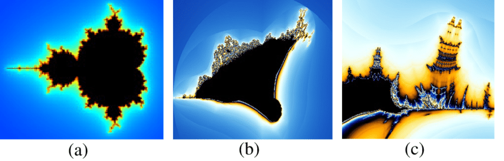

# Fract-ol




Fract-ol is a project that generates fractals such as the Mandelbrot set, Julia set, and Burning Ship using the MiniLibX library. This project includes additional features like rendering progress visualization and printing key presses.

## Features

- **Mandelbrot**: Generates the Mandelbrot fractal.
- **Julia**: Generates the Julia fractal with customizable parameters.
- **Burning Ship**: Generates the Burning Ship fractal.
- **Zoom and Movement**: Allows zooming and moving the fractal with the mouse and arrow keys.
- **Color Scheme Change**: Changes the color scheme with the keys `1`, `2`, `3`, and `4`.
- **Key Press Printing**: Displays the pressed key and associated action in the terminal.
- **Rendering Progress**: Shows the rendering progress in the terminal.

## New Functions

### `print_key_action(int keycode)`

This function prints the pressed key and its associated action in the terminal. It is called every time a key is pressed in the fractal window.

```c
void	print_key_action(int keycode)
{
	ft_printf("Key pressed: %d ", keycode);
	if (keycode == 65307)
		ft_printf("🛑\n");
	else if (keycode == 49)
		ft_printf("🎨\n");
	else if (keycode == 50)
		ft_printf("🎨\n");
	else if (keycode == 51)
		ft_printf("🎨\n");
	else if (keycode == 52)
		ft_printf("🎨\n");
	else if (keycode == 65451)
		ft_printf("➕\n");
	else if (keycode == 65453)
		ft_printf("➖\n");
	else if (keycode == 65362)
		ft_printf("⬆️\n");
	else if (keycode == 65364)
		ft_printf("⬇️\n");
	else if (keycode == 65361)
		ft_printf("⬅️\n");
	else if (keycode == 65363)
		ft_printf("➡️\n");
	else
		ft_printf("❓\n");
}
```

### `print_progress(int progress)`

This function shows the rendering progress in the terminal. It is called during the fractal rendering to indicate the percentage completed.

```c
void	print_progress(int progress)
{
	const char	*spinner[] = {"⠋", "⠙", "⠹", "⠸", "⠼", "⠴", "⠦", "⠧", "⠇", "⠏"};
	static int	spinner_index = 0;

	ft_printf("\r%s Processing [%d%%]", spinner[spinner_index], progress);
	spinner_index = (spinner_index + 1) % 10;
}
```

## Usage

### Compilation

To compile the project, use the following command:

```bash
make
```

### Execution

To run the program, use the following format:

```bash
./fractol <fractal> <max_iter>
```

- `<fractal>`: Can be `M` for Mandelbrot, `J` for Julia, or `B` for Burning Ship.
- `<max_iter>`: Maximum number of iterations for the fractal calculation.

#### Examples

- **Mandelbrot**:
  ```bash
  ./fractol M 100
  ```

- **Julia**:
  ```bash
  ./fractol J -0.7 0.27015 100
  ```

- **Burning Ship**:
  ```bash
  ./fractol B 100
  ```

### Controls

- **Arrow Keys**: Move the fractal.
- **Mouse Wheel**: Zoom in and out.
- **Keys `1`, `2`, `3`, `4`**: Change the color scheme.
- **`Esc` Key**: Closes the window and terminates the program.

## Integration of New Functions

The functions `print_key_action` and `print_progress` are already integrated into the provided code. The `print_key_action` function is called inside `handle_keypress` to print the pressed key, and `print_progress` is called during the rendering of each fractal to show the progress.

```c
int	handle_keypress(int keycode, t_fractal *f)
{
	print_key_action(keycode);
	key_hook(keycode, f);
	move_fractal(keycode, f);
	adjust_iterations(keycode, f);
	return (0);
}
```

```c
void	burning_ship(t_fractal *f)
{
	int	x;
	int	y;
	int	progress;
	int	new_progress;

	y = 0;
	progress = 0;
	while (y < f->height)
	{
		x = 0;
		while (x < f->width)
		{
			process_pixel(f, x, y);
			x++;
		}
		new_progress = (y * 100) / f->height;
		if (new_progress != progress)
		{
			progress = new_progress;
			print_progress(progress);
		}
		y++;
	}
}
```

## Complete Fractal Functions

### `burning_ship.c`

```c
/* ************************************************************************** */
/*                                                                            */
/*                                                        :::      ::::::::   */
/*   burning_ship.c                                     :+:      :+:    :+:   */
/*                                                    +:+ +:+         +:+     */
/*   By: rmarrero <marvin@42.fr>                    +#+  +:+       +#+        */
/*                                                +#+#+#+#+#+   +#+           */
/*   Created: 2025/02/19 17:07:41 by rmarrero          #+#    #+#             */
/*   Updated: 2025/02/19 20:24:16 by rmarrero         ###   ########.fr       */
/*                                                                            */
/* ************************************************************************** */
#include "../../include/fractol.h"

void	process_pixel(t_fractal *f, int x, int y)
{
	double	zx;
	double	zy;
	int		iter;
	double	tmp;

	zx = 0.0;
	zy = 0.0;
	iter = 0;
	tmp = 0;
	while (zx * zx + zy * zy < 4 && iter < f->max_iter)
	{
		tmp = zx * zx - zy * zy + (x - f->width / 2.0) * 4.0 / (f->width
				* f->zoom) + f->move_x;
		zy = ft_fabs_double(2.0 * zx * zy + (y - f->height / 2.0) * 4.0
				/ (f->height * f->zoom) + f->move_y);
		zx = ft_fabs_double(tmp);
		iter++;
	}
	put_pixel(f, x, y, get_color(iter, f->max_iter, f));
}

//burning_ship draw
void	burning_ship(t_fractal *f)
{
	int	x;
	int	y;
	int	progress;
	int	new_progress;

	y = 0;
	progress = 0;
	while (y < f->height)
	{
		x = 0;
		while (x < f->width)
		{
			process_pixel(f, x, y);
			x++;
		}
		new_progress = (y * 100) / f->height;
		if (new_progress != progress)
		{
			progress = new_progress;
			print_progress(progress);
		}
		y++;
	}
}
```

#### Explanation of Burning Ship Fractal

The Burning Ship fractal is a variation of the Mandelbrot set. It is defined by the iterative formula:

\[ z_{n+1} = (|Re(z_n)| + i|Im(z_n)|)^2 + c \]

Where:
- \( z \) is a complex number.
- \( c \) is a constant complex number derived from the pixel coordinates.
- The absolute values of the real and imaginary parts of \( z \) are taken at each iteration, giving the fractal its characteristic "ship-like" appearance.

### `julia.c`

```c
/* ************************************************************************** */
/*                                                                            */
/*                                                        :::      ::::::::   */
/*   julia.c                                            :+:      :+:    :+:   */
/*                                                    +:+ +:+         +:+     */
/*   By: rmarrero <marvin@42.fr>                    +#+  +:+       +#+        */
/*                                                +#+#+#+#+#+   +#+           */
/*   Created: 2025/02/19 17:07:41 by rmarrero          #+#    #+#             */
/*   Updated: 2025/02/19 20:24:16 by rmarrero         ###   ########.fr       */
/*                                                                            */
/* ************************************************************************** */
#include "../../include/fractol.h"

static void	process_julia_pixel(t_fractal *f, int x, int y)
{
	double	zx;
	double	zy;
	int		iter;
	double	tmp;

	zx = (x - f->width / 2.0) * 4.0 / (f->width * f->zoom) + f->move_x;
	zy = (y - f->height / 2.0) * 4.0 / (f->height * f->zoom) + f->move_y;
	iter = 0;
	while (zx * zx + zy * zy < 4 && iter < f->max_iter)
	{
		tmp = zx * zx - zy * zy + f->c_julia_real;
		zy = 2.0 * zx * zy + f->c_julia_imag;
		zx = tmp;
		iter++;
	}
	put_pixel(f, x, y, get_color(iter, f->max_iter, f));
}

//julia draw
void	julia(t_fractal *f)
{
	int	progress;
	int	new_progress;
	int	x;
	int	y;

	progress = 0;
	y = 0;
	while (y < f->height)
	{
		x = 0;
		while (x < f->width)
		{
			process_julia_pixel(f, x, y);
			x++;
		}
		new_progress = (y * 100) / f->height;
		if (new_progress != progress)
		{
			progress = new_progress;
			print_progress(progress);
		}
		y++;
	}
}
```

#### Explanation of Julia Fractal

The Julia set is defined by the iterative formula:

\[ z_{n+1} = z_n^2 + c \]

Where:
- \( z \) is a complex number.
- \( c \) is a constant complex number that determines the shape of the fractal.
- The initial value of \( z \) is derived from the pixel coordinates.

The Julia set is closely related to the Mandelbrot set, but while the Mandelbrot set varies \( c \) and fixes \( z_0 = 0 \), the Julia set fixes \( c \) and varies \( z_0 \).

### `mandelbrot.c`

```c
/* ************************************************************************** */
/*                                                                            */
/*                                                        :::      ::::::::   */
/*   mandelbrot.c                                       :+:      :+:    :+:   */
/*                                                    +:+ +:+         +:+     */
/*   By: rmarrero <marvin@42.fr>                    +#+  +:+       +#+        */
/*                                                +#+#+#+#+#+   +#+           */
/*   Created: 2025/02/19 19:07:54 by rmarrero          #+#    #+#             */
/*   Updated: 2025/02/19 19:08:18 by rmarrero         ###   ########.fr       */
/*                                                                            */
/* ************************************************************************** */
#include "../../include/fractol.h"

void	process_pixel_m(t_fractal *f, int x, int y)
{
	double	zx;
	double	zy;
	int		iter;
	double	tmp;

	zx = 0.0;
	zy = 0.0;
	iter = 0;
	tmp = 0;
	while (zx * zx + zy * zy < 4 && iter < f->max_iter)
	{
		tmp = zx * zx - zy * zy + (x - f->width / 2.0) * 4.0 / (f->width
				* f->zoom) + f->move_x;
		zy = 2.0 * zx * zy + (y - f->height / 2.0) * 4.0 / (f->height * f->zoom)
			+ f->move_y;
		zx = tmp;
		iter++;
	}
	put_pixel(f, x, y, get_color(iter, f->max_iter, f));
}

//mandelbrot draw
void	mandelbrot(t_fractal *f)
{
	int	progress;
	int	new_progress;
	int	x;
	int	y;

	progress = 0;
	y = 0;
	while (y < f->height)
	{
		x = 0;
		while (x < f->width)
		{
			process_pixel_m(f, x, y);
			x++;
		}
		new_progress = (y * 100) / f->height;
		if (new_progress != progress)
		{
			progress = new_progress;
			print_progress(progress);
		}
		y++;
	}
}
```

#### Explanation of Mandelbrot Fractal

The Mandelbrot set is defined by the iterative formula:

\[ z_{n+1} = z_n^2 + c \]

Where:
- \( z \) is a complex number.
- \( c \) is a constant complex number derived from the pixel coordinates.
- The initial value of \( z \) is \( z_0 = 0 \).

The Mandelbrot set is the set of complex numbers \( c \) for which the sequence \( z_n \) does not diverge to infinity. The fractal is visualized by coloring each point \( c \) based on how quickly the sequence \( z_n \) diverges.

## Contributions

If you wish to contribute to this project, please follow these guidelines:

1. Fork the repository.
2. Create a new branch (`git checkout -b feature/new-feature`).
3. Make your changes and commit them (`git commit -am 'Add new feature'`).
4. Push to the branch (`git push origin feature/new-feature`).
5. Open a Pull Request.

## License

This project is licensed under the MIT License. For more details, see the [LICENSE](LICENSE) file.